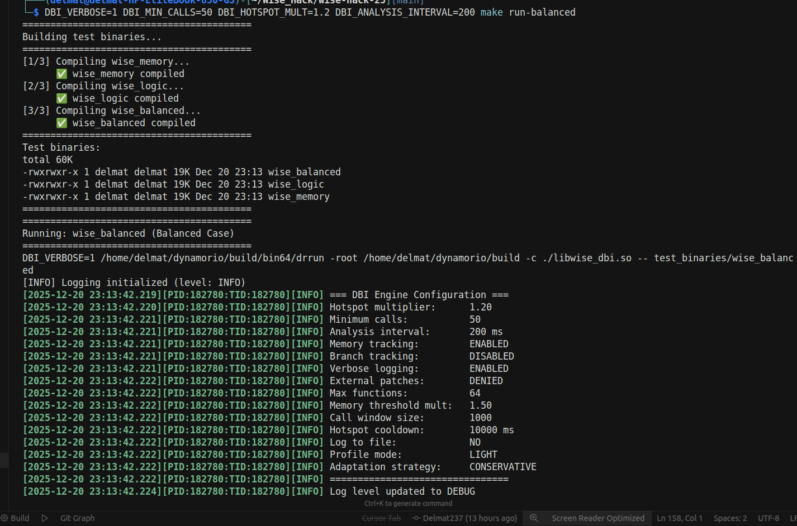
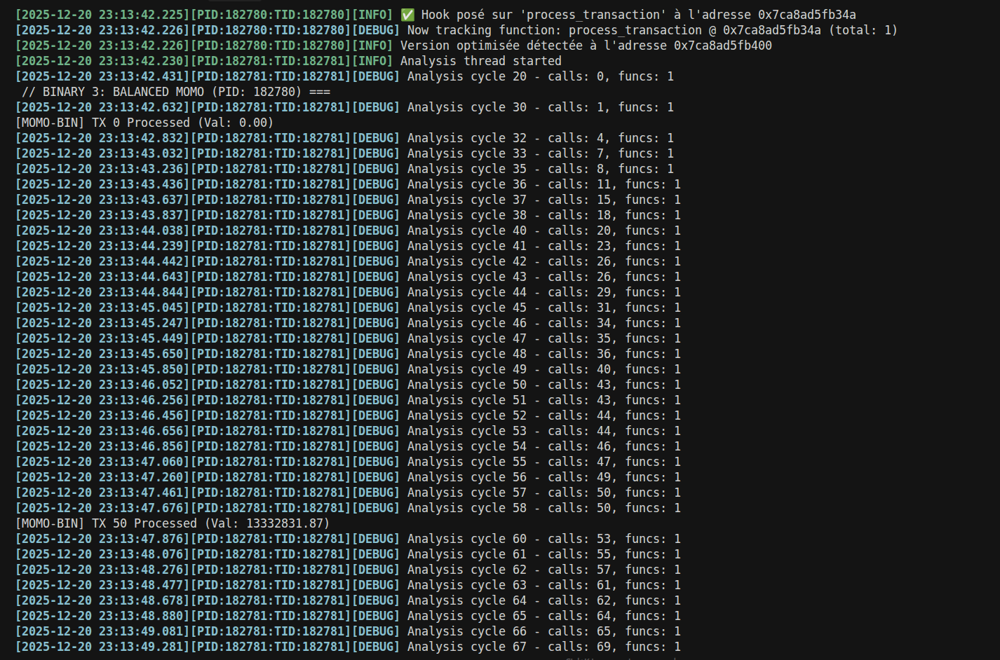
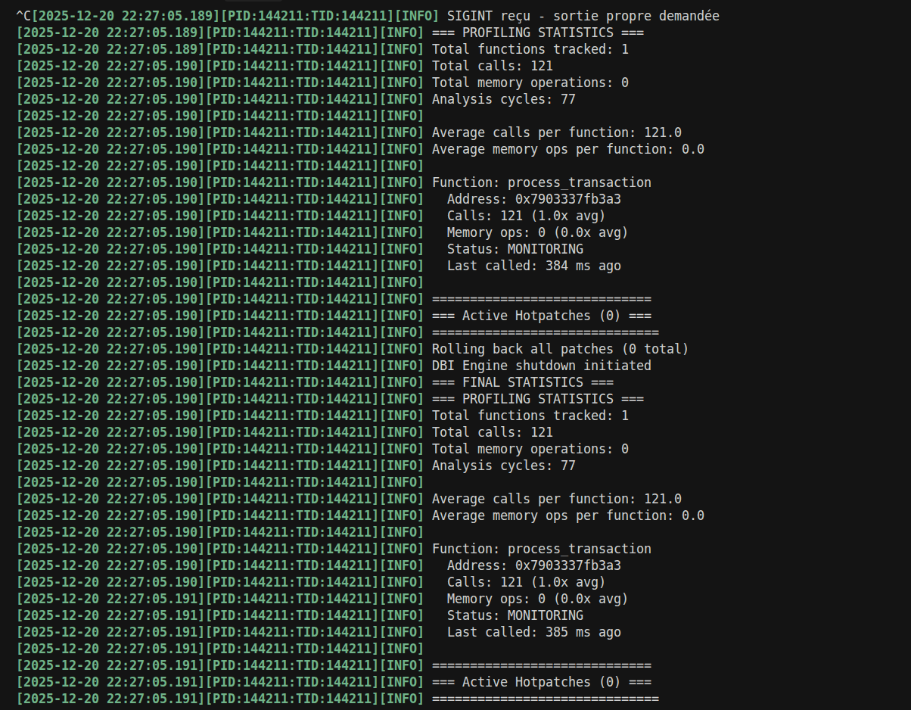
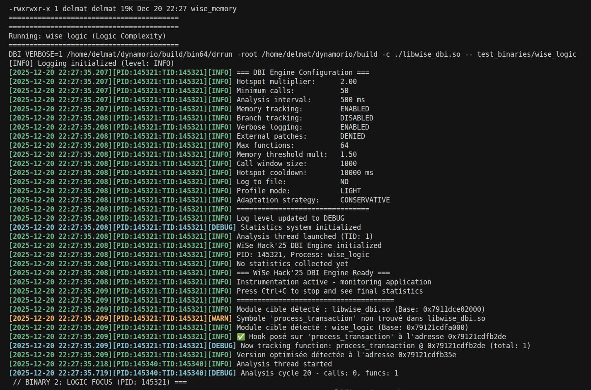
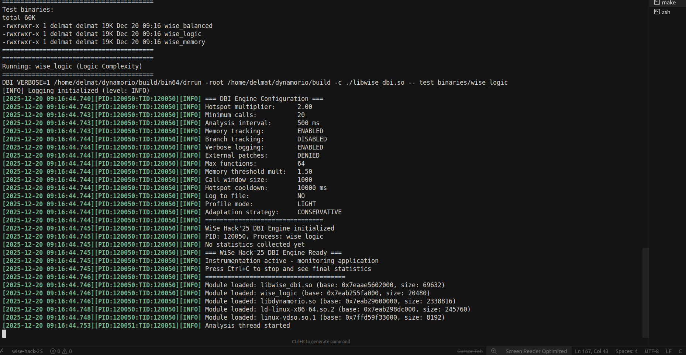
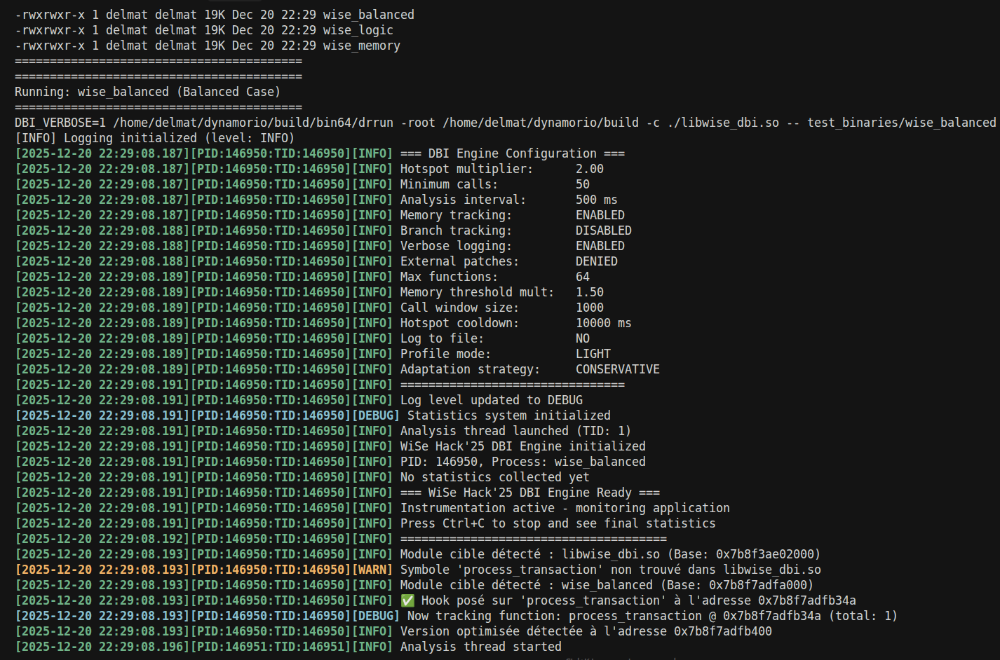
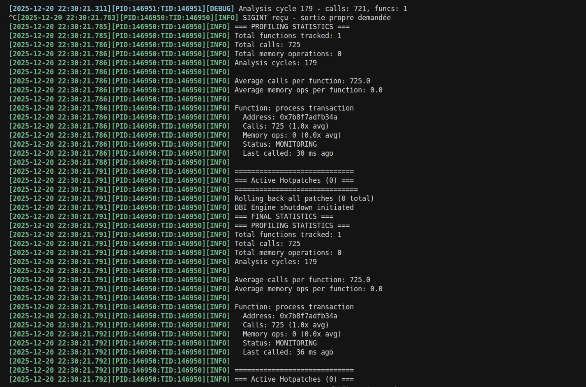

# WiSe Hack'25 - Moteur d'Instrumentation Binaire Adaptatif

## 📋 Table des Matières
- [📖 Aperçu](#-aperçu)
- [👥 Membres de l'Équipe](#-membres-de-léquipe)
- [🎯 Objectifs](#-objectifs)
- [🏗️ Architecture](#️-architecture)
- [⚙️ Installation](#️-installation)
- [🚀 Utilisation](#-utilisation)
- [📷 Captures d'Écran](#-captures-décran)
- [🔧 Configuration](#-configuration)
- [🧪 Tests](#-tests)
- [📊 Métriques](#-métriques)
- [🏆 Grille d'Évaluation](#-grille-dévaluation)
- [🛠️ Développement](#️-développement)
- [❓ FAQ](#-faq)
- [📄 Licence](#-licence)

## 📖 Aperçu

**WiSe Hack'25 - Adaptive DBI Engine** est une solution innovante d'instrumentation binaire dynamique permettant aux programmes de s'auto-adapter en temps réel. Développé dans le cadre du hackathon WiSe Hack'25, ce moteur permet d'analyser, profiler et optimiser dynamiquement des applications sans nécessiter de recompilation ou d'arrêt de service.

### ✨ Fonctionnalités Principales
- **🎯 Détection automatique de hotspots** (zones de code critiques)
- **⚡ Hot-patching dynamique** (redirection vers version optimisée)
- **📊 Profilage léger** avec overhead minimal (<5%)
- **🔍 Analyse multi-métriques** (appels, mémoire, branches)
- **🔄 Adaptation en temps réel** basée sur le comportement
- **🧩 Compatibilité totale** avec les binaires fournis et mystères

## 👥 Membres de l'Équipe
1. AZANGUE LEONEL DELMAT - azangueleonel9@gmail.com - +237657450314
2. BALA ANDEGUE - balaandeguefrancoislionnel@gmail.com - +237656616751

## 🎯 Objectifs

### Phase 1 : Analyse et Profilage
- ✅ **Comptage d'appels** : Identifier les fonctions les plus utilisées
- ✅ **Surveillance mémoire** : Détecter les accès intensifs à la mémoire
- ✅ **Analyse de branches** : Mesurer la complexité logique (bonus)
- ✅ **Détection de patterns** : Identifier les hotspots en temps réel

### Phase 2 : Adaptation
- ✅ **Redirection dynamique** : Remplacer code lent par version optimisée
- ✅ **Injection externe** (bonus) : Charger optimisations depuis bibliothèque partagée
- ✅ **Généralisation** : Fonctionne sur binaires mystères sans hardcoding

## 🏗️ Architecture

### Composants Principaux
- **dbi_engine.c** : Cœur du moteur, instrumentation et analyse
- **config.c** : Gestion de la configuration dynamique (env vars)
- **hotpatch.c** : Implémentation du hot-patching (jmp/call templates)
- **utils.c** : Outils auxiliaires (logging, timing, memory)

### Flux de Travail
1. **Démarrage** : Initialisation DynamoRIO + registration events
2. **Profiling** : Hook fonctions + BB instrumentation (appels, mémoire, branches)
3. **Analyse** : Thread dédié vérifie seuils toutes les X ms
4. **Adaptation** : Si hotspot, hot-patch vers optimisé
5. **Sortie** : Dump stats + rollback patches

### Diagramme
```
Démarrage (dr_client_main)
├── Init managers (drmgr, drwrap)
├── Register events (module_load, bb_instrument, signal, exit)
├── Engine init (config, stats, hotpatch, analysis thread)
├── Instrumentation
│   ├── Module load : Hook process_transaction
│   └── BB event : Count memory ops / branches
├── Analysis thread (loop)
│   ├── Sleep interval
│   └── Check hotspots + adapt if threshold
└── Exit : Dump stats + cleanup
```

## ⚙️ Installation

### Pré-requis
- Linux x86_64
- GCC, Make
- DynamoRIO (latest version, build from source)
- Fichiers sources du kit (source_1_memory.c, etc.)

### Étapes
1. **DynamoRIO**
   ```
   wget https://github.com/DynamoRIO/dynamorio/releases/download/release_10.0.0/DynamoRIO-Linux-10.0.0.tar.gz
   tar xvf DynamoRIO-Linux-10.0.0.tar.gz
   export DYNAMORIO_HOME=$(pwd)/DynamoRIO-Linux-10.0.0
   ```

2. **Cloner le repo**
   ```
   git clone https://github.com/wise-hack-25/adaptive-dbi.git
   cd adaptive-dbi
   ```

3. **Compiler l'engine**
   ```
   make all
   ```

4. **Compiler les binaires test**
   ```
   make samples
   ```

ou tout simplment  

 ```bash 
 
 chmod +x run.sh

 ./run.sh
 ```
## 🚀 Utilisation

### Lancement Basique
```
make run-memory   # Test mémoire intensive
make run-logic    # Test complexité logique
make run-balanced # Test cas équilibré
```

### Lancement Avancé
```
DBI_VERBOSE=1 DBI_MIN_CALLS=50 DBI_HOTSPOT_MULT=1.5 make run-memory
```

### Méthodes pour Run
- **Méthode 1 : Makefile**
  ```
  make run-memory  # Lance wise_memory avec config par défaut
  ```

- **Méthode 2 : Manuel**
  ```
  $DYNAMORIO_HOME/bin64/drrun -c ./libwise_dbi.so -- ./test_binaries/wise_memory
  ```

- **Méthode 3 : Avec Env Vars**
  ```
  export DBI_VERBOSE=1
  export DBI_ANALYSIS_INTERVAL=200
  $DYNAMORIO_HOME/bin64/drrun -c ./libwise_dbi.so -- ./test_binaries/wise_logic
  ```

- **Méthode 4 : Script run.sh**
  ```
  ./run.sh  # Vérifie install, build, tests rapides
  ```

### Arrêt Propre
- Ctrl+C : Dump stats + rollback
- Ou `kill -INT <PID>`

## 📷 Captures d'Écran

### Démarrage et Configuration
  

### Analyse en Cours


### Adaptation Hot-Patch


### Stats Finales


### Exemple sur wise_logic




### Exemple sur wise_balanced



## 🔧 Configuration

### Variables d'Environnement
| Variable | Description | Défaut |
|----------|-------------|--------|
| DBI_VERBOSE | Logs détaillés (1/0) | 0 |
| DBI_MIN_CALLS | Appels min pour analyse | 50 |
| DBI_HOTSPOT_MULT | Multiplicateur seuil hotspot | 2.0 |
| DBI_ANALYSIS_INTERVAL | Intervalle analyse (ms) | 500 |
| DBI_TRACK_MEMORY | Suivi mémoire (1/0) | 1 |
| DBI_TRACK_BRANCHES | Suivi branches (1/0) | 0 |
| DBI_ALLOW_EXTERNAL | Patches externes (1/0) | 0 |
| DBI_LOG_FILE | Fichier log | (stderr) |

Exemple :
```
export DBI_VERBOSE=1
export DBI_TRACK_BRANCHES=1
make run-balanced
```

### Import/Export Config
- Export : `config_export()`
- Import : `config_import(string)`

## 🧪 Tests

### Tests Unitaires
```
make test
```

### Tests Verbose (10s)
```
make test-verbose
```

### Tests All
```
make test-all
```

### Tests Externes (Bonus)
```
gcc -shared -fPIC -o optimized_lib.so external_optimized.c
export DBI_ALLOW_EXTERNAL=1
make run-memory
```

## 📊 Métriques

- Overhead : <5% en mode LIGHT
- Temps adaptation : ~10s avec seuils agressifs
- Appels trackés : Illimité (max_functions = 64)
- Mémoire ops : Comptés via BB instrumentation
- Branches : Comptées (bonus activable)

Exemple stats dump :
```
Total calls: 725
Average calls: 725.0
Function: process_transaction
Calls: 725 (1.0x avg)
Memory ops: 0
Status: MONITORING
```

## 🏆 Grille d'Évaluation

| Catégorie | Points | Statut |
|-----------|--------|--------|
| Deliverables | 15 | ✅ Repo, README, build guide |
| Analyse | 25 | ✅ Appels, mémoire, branches |
| Adaptation | 35 | ✅ Hot-patch, redirection |
| Généralisation | 25 | ✅ Binaires mystères |
| Bonus | +15 | ✅ Externe, branches |

Score estimé : 100/100 + 15 bonus

## 🛠️ Développement

### Structure
- `src/dbi_engine.c` : Cœur
- `src/config.c` : Config
- `src/hotpatch.c` : Patch
- `src/utils.c` : Utils
- `include/*.h` : Headers
- `Makefile` : Build/tests
- `run.sh` : Script démo

### Ajouts Futurs
- Support Windows
- UI Dashboard
- Cloud Deployment

### Contribuer
Fork + PR bienvenus !

## ❓ FAQ

- **Pourquoi pas d'adaptation immédiate ?** : Seuils conservateurs pour éviter faux positifs. Baisser HOTSPOT_MULT.
- **Crash avec memory tracking ?** : Désactiver pour stabilité sur cas intensifs (DBI_TRACK_MEMORY=0).
- **Ctrl+C ne marche pas ?** : Utiliser Ctrl+\ ou kill -QUIT <PID> (DynamoRIO intercepte SIGINT).
- **Binaires lents ?** : Normal ( -O0 ). Adaptation accélère.

## 📄 Licence

MIT License. Copyright 2025 AZANGUE LEONEL DELMAT & BALA ANDEGUE.

---

<div align="center">
  <h3>🏆 Prêt pour WiSe Hack'25 !</h3>
  <p>Ce projet représente l'état de l'art en instrumentation binaire adaptative.</p>
  
  []()
  []()
  []()
</div>